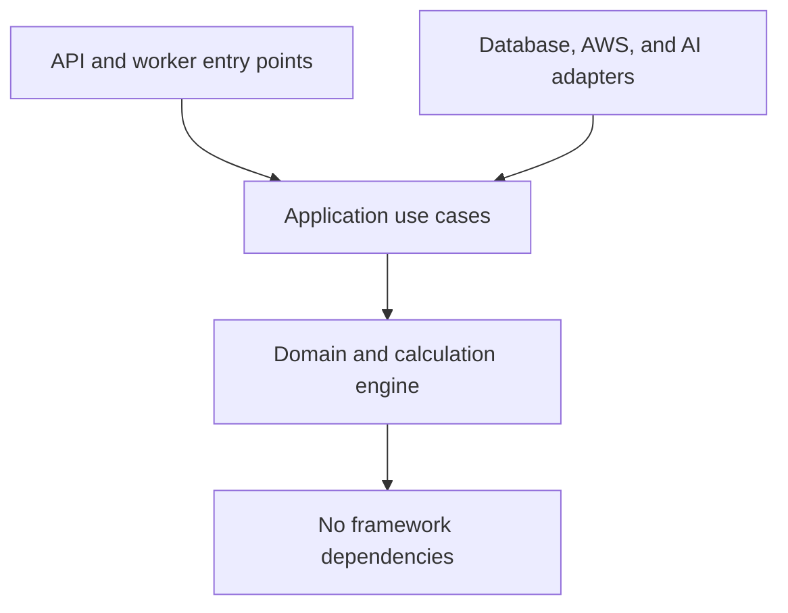
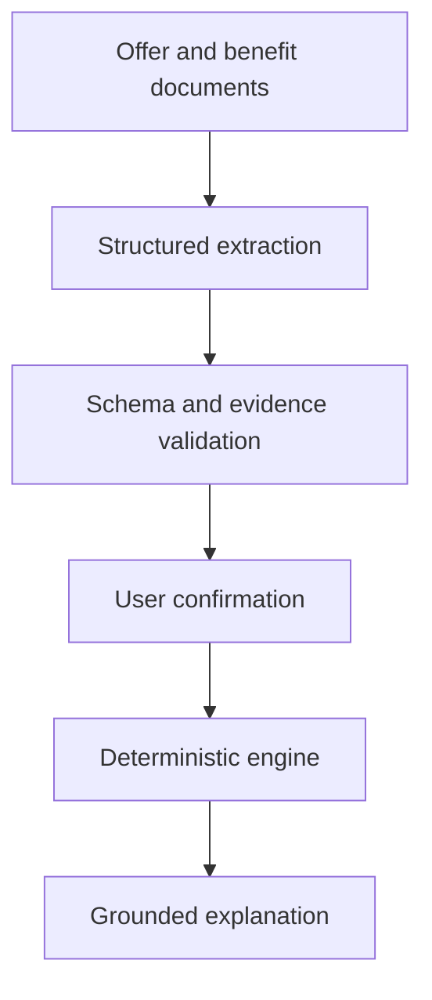
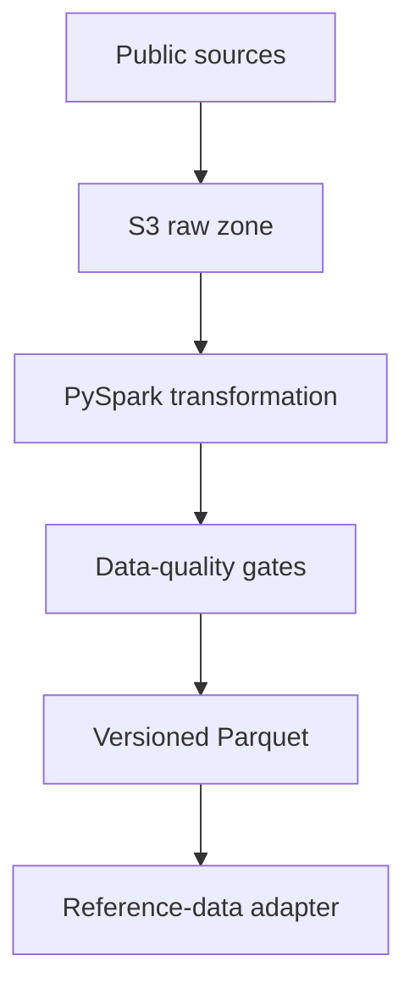
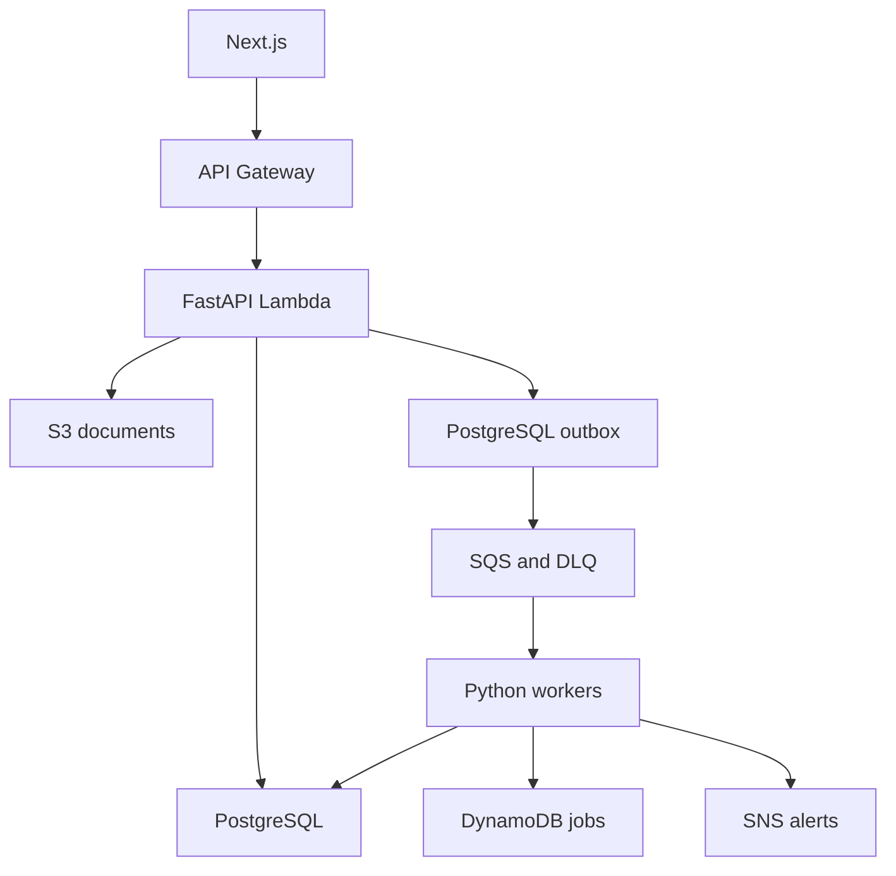
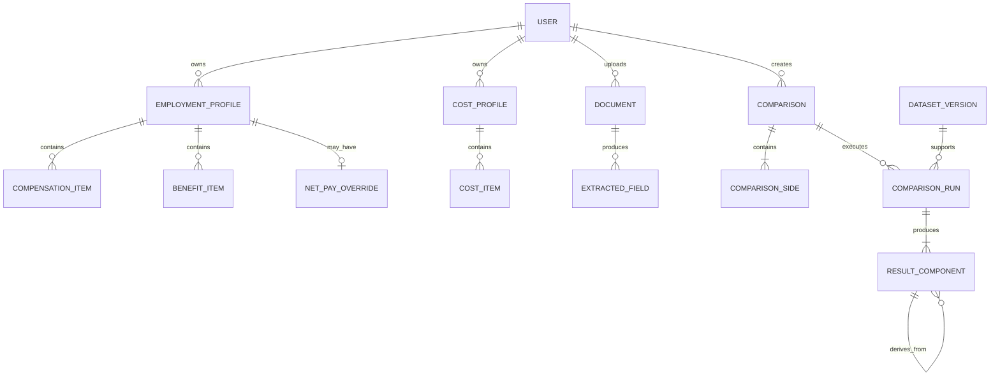

# OfferDelta Development Blueprint

> Personalized Job Offer and Relocation Decision Engine
> Version: 0.2
> Status: Phased delivery baseline
> Last updated: 2026-08-17

**What changed in 0.2:** scope split into a five-week phase 1, a tax-engine phase 2, and two
order-independent tracks, each behind a hard gate; cost categories given single ownership to prevent
double counting; explicit periods on every amount; RSU value taken net of tax; break-even reports
first and stable crossings; net-pay override given an invalidation rule and a companion tax-model
port so the solvers still work; `RoundingPolicy` separated from `Money`; money pinned to strings
across the API boundary; derivation tree and a week-one walking skeleton promoted into phase 1. See
[Appendix A](#appendix-a-changes-from-version-01) for the full list and rationale.

---

## 1. Project statement

OfferDelta calculates the real economic difference between a current job and a new offer by
combining actual personal spending, the full terms of an offer, taxes and payroll deductions,
housing and relocation costs, commuting cash and time, public regional data, and explicit
uncertainty assumptions.

The product answers:

> What salary in the target location would preserve my current standard of living, when would the
> move break even, and which offer terms would close the remaining gap?

The first real use case is comparing a current job in Auburn, Alabama with opportunities in New
Jersey or New York.

---

## 2. Why this project exists

Most salary and cost-of-living calculators rely on generic averages and compare only gross salary
or estimated take-home pay. OfferDelta is differentiated by combining a user's real spending
profile with the complete terms of an offer and versioned public data, and by making every number
traceable to its inputs, formula, and rule version.

| Project | Primary evidence |
|---|---|
| picking-up | Product UX, transactional APIs, concurrency, full-stack delivery, deployment |
| OfferDelta | Python backend, financial rules, auditable calculation, AWS workflows, document AI, evaluation |

### 2.1 Positioning language

The calculation core is designed using **model-governance principles**: versioned rule sets,
immutable calculation runs, complete input lineage, reproducible results, explicit stress
scenarios, and per-number derivations.

This is an engineering description, not a compliance claim. The following sentence belongs in the
README verbatim:

> OfferDelta has not been through an independent model validation process. The governance
> properties described here are engineering choices made to keep the calculation auditable.

Do not claim the project was built under SR 11-7 or any regulatory regime. The honest version is a
stronger signal than the inflated one, and the inflated one fails the first follow-up question.

Describe this as portfolio work, never as professional banking production experience.

---

## 3. Locked decisions

| Area | Decision |
|---|---|
| Product | OfferDelta |
| Core calculation module | LifeShock Engine |
| Backend language | Python |
| API framework | FastAPI |
| Validation | Pydantic v2 |
| ORM | SQLAlchemy 2 |
| Database migrations | Alembic |
| Operational database | PostgreSQL |
| Frontend | Next.js and TypeScript |
| Monetary representation | `Decimal` and PostgreSQL `NUMERIC`; never `float` |
| Rounding | Per-context `RoundingPolicy`; no single global rule |
| Calculation role | Deterministic Python only |
| AI role | Document extraction, document Q&A, missing-input assistance, result explanation |
| Initial data entry | Manual form first; document extraction later |
| Architecture | Modular monolith plus separately deployed workers |
| Phase 1 hosting | Single container on Render or Fly.io plus Neon PostgreSQL |
| Track B hosting | AWS, with measured before/after cost and latency |
| Infrastructure as code | Terraform, introduced in track B only |
| CI/CD | GitHub Actions, AWS OIDC when AWS arrives |

### 3.1 Deferred decisions

- Exact LLM provider
- OCR provider
- Plaid or live financial-account connection
- State-income-tax coverage beyond AL, NJ, NY
- RDS versus Neon for the final production database
- Monte Carlo simulation
- Couple or household collaboration
- Kafka and Kubernetes

### 3.2 Explicitly excluded from every phase and track

- AWS Step Functions. SQS plus a worker demonstrates the same async competence at a fraction of the
  setup cost.
- RAG document question answering. Structured extraction with an evaluation harness is the stronger
  AI story; retrieval Q&A is additive, not differentiating.
- Microservices, event sourcing, full CQRS, dependency-injection frameworks.

Deferred and excluded items must not block the first deployed vertical slice.

---

## 4. Delivery phases

The failure mode this project must avoid is a superb design document with no deployed product. A
design document is not a hiring signal. A working, explainable, deployed calculator is.

Each phase ends at a gate. **Do not begin the next phase until the current gate is met.**

### 4.1 Five weeks is a commitment; five months is a ceiling

Phase 1 is a fixed five-week commitment. The remaining phases total roughly four to five months of
part-time work, but that figure is a **ceiling, not a plan**.

Two reasons it should be read that way:

1. **Getting hired ends the project.** That is the success condition. If an offer arrives in month
   two, neither track ever happens and nothing is lost. The phase structure exists so that stopping
   at any gate leaves a coherent, presentable project rather than a half-built one.
2. **Job hunting consumes the same hours.** Applications, interview preparation, and take-homes will
   cut development velocity from month two onward. Assume phases after the first run slower than
   estimated. That is fine, because from week five onward you are applying with a live demo rather
   than waiting to have one.

There is also a change in what the project is *for* after phase 1. Before the gate, it is the thing
being built to get interviews. After the gate, it is the thing being discussed *in* interviews — and
in that role, depth beats breadth. A tax engine you can discuss for twenty minutes is worth more
than six AWS services you touched once and cannot defend. Prefer finishing one track well over
starting both.

### Phase 1 — Trustworthy, explainable, deployed comparison

Target: 5 weeks part-time. Covers milestones 0 through 6.5.

Scope is fixed in `docs/planning/PHASE-1-SCOPE.md`. Anything not on that list is out.

Week one includes a **walking skeleton**: a hardcoded profile through one calculator, one API
endpoint, one rendered number with its derivation, deployed to a live URL. Ugly is fine; working is
required. Its purpose is to prove the deployment path and the money-serialization boundary
(section 18.6) while both are still trivial to debug, rather than discovering them in week five.

**Gate:**

- A live URL a stranger can open.
- A non-developer can complete the Auburn to New Jersey comparison end to end.
- Every number in the result is clickable and shows its full derivation.
- The monthly cash-flow reconciliation invariant passes for every month in every scenario band.
- No AWS, no Terraform, no LLM, no Spark.

### Phase 2 — Real tax engine

Target: 2–3 weeks. Covers milestone 3b.

This comes immediately after phase 1 regardless of anything else, because it *completes the
product*. Phase 1 ships with the honest caveat that take-home pay came from a figure the user
supplied. Phase 2 removes that caveat and converts the multi-jurisdiction rules in section 15.2 into
the strongest financial-correctness evidence in the project — which is also the most relevant
evidence for a banking role.

**Gate:**

- Computed tax for AL, NJ, and NY reproduces the verified net-pay override on the real profile
  within a stated tolerance, and the tolerance is published.
- Unsupported jurisdictions raise explicit errors rather than approximating.

### Phases 3 and 4 — order decided by the job market, not by this document

Two independent tracks remain. Do them in whichever order the roles you are actually applying to
call for. You will have real job descriptions in hand by week five that you do not have today, so
this ordering is deliberately left open.

**Track A — Document extraction and evaluation.** Target 4–6 weeks, covers milestone 9. Choose first
if the roles lean fintech, AI-adjacent, or data-extraction heavy.

*Gate:* a synthetic evaluation report generates automatically from a golden document set, and
unsupported critical numeric values equal zero on the published set.

**Track B — Async AWS and public-data pipeline.** Target 4–6 weeks, covers milestones 7 and 8. Choose
first if the roles emphasize AWS, queues, distributed systems, or Spark.

*Gate:* job submission returns `202`, duplicate delivery is safe, a failed job reaches its DLQ, a
corrected DLQ message replays safely, and cost and p95 latency are measured and published before and
after the migration.

The track B migration write-up — why the single container was outgrown, what the numbers were before
and after — is worth more in an interview than having started on AWS.

### 4.2 Merge and redeploy at every phase

Sequential phases must not become long-lived branches. Each phase ends with the live deployment
updated and the README updated. Five weeks of phase-two work sitting unmerged while the demo URL
still serves the phase-one build is the version of this plan that fails.

---

## 5. Product scope

### 5.1 MVP user flow

1. Create a current employment profile.
2. Create a candidate job offer.
3. Enter housing, commute, benefits, and relocation assumptions.
4. Enter a personal spending baseline.
5. Run a one-year and three-year comparison.
6. Review disposable cash, wealth value, time cost, and liquidity.
7. Calculate equivalent target-location salary.
8. Calculate move break-even month.
9. Calculate negotiation-gap alternatives.
10. Inspect the derivation of any number in the result.

### 5.2 MVP outputs

- Monthly estimated take-home pay
- First-year disposable-cash difference
- Three-year cumulative cash difference
- Three-year wealth-value difference
- Required cash on move date
- First crossing month and stable break-even month
- Equivalent target-location salary
- Effective hourly cash compensation
- Annual commute time
- Top positive and negative variables
- Conservative, expected, and optimistic comparison
- Negotiation-gap alternatives
- Per-component derivation

### 5.3 Not in the MVP

Tax-filing advice, investment recommendations, automatic job application, autonomous negotiation,
payroll or money movement, retirement planning, AI-generated financial numbers, multi-user
collaboration, every US state and municipality.

---

## 6. Calculation boundaries

OfferDelta must not collapse everything into one misleading score. It calculates separate
dimensions, and every amount carries an explicit period.

### 6.1 Periods

Amounts are never bare. Every amount that enters or leaves the engine carries a period.

```python
class PeriodKind(StrEnum):
    MONTHLY = "MONTHLY"
    ANNUAL = "ANNUAL"
    ONE_TIME = "ONE_TIME"
    HORIZON_CUMULATIVE = "HORIZON_CUMULATIVE"


@dataclass(frozen=True)
class PeriodicAmount:
    money: Money
    period: PeriodKind
```

Normalization happens in exactly one module. Pay-frequency conversion uses explicit factors, not
approximations:

```text
WEEKLY       -> 52 periods per year
BIWEEKLY     -> 26 periods per year
SEMIMONTHLY  -> 24 periods per year
MONTHLY      -> 12 periods per year
```

Biweekly is 26 periods, not 24, and the two are not interchangeable. Reading a biweekly paycheck as
semimonthly drops two periods and **understates** annual pay by about 7.7 percent; the reverse
mistake overstates it by about 8.3 percent.

### 6.2 Disposable cash

Defined per month, then summed. One-time flows appear in the month they occur, in both directions.

```text
monthly_disposable_cash(m) =
      monthly_after_tax_cash_income(m)
    - monthly_housing_cash(m)
    - monthly_health_cash(m)
    - monthly_commute_cash(m)
    - monthly_living_cash(m)
    - one_time_cash_outflows(m)
    + one_time_cash_inflows(m)

horizon_cumulative_cash(H) = sum of monthly_disposable_cash(m) for m in H
```

One-time inflows include the signing bonus and relocation reimbursement. Version 0.1 omitted the
inflow term, which would have made every offer with a signing bonus look worse than it is.

### 6.3 Wealth value

```text
wealth_value(H) =
      horizon_cumulative_cash(H)
    + vested_employer_match(H)
    + net_vested_equity(H)
    + employer_hsa_contribution(H)

net_vested_equity(H) =
      sum over vest events in H of
          gross_vest_value * (1 - estimated_withholding_rate)
    - estimated_sale_fees
```

RSUs vest as ordinary income and are taxed on vest. Adding gross equity systematically overstates
any offer containing equity, which is the exact case where the tool most needs to be right.

`estimated_withholding_rate` is a user-supplied input in phase 1. Do not build an equity tax engine.

Unvested equity and unvested match are reported separately and never enter `wealth_value`.

**Discounting.** `discount_rate_annual` is an explicit assumption defaulting to `0.00`. It appears
in the derivation tree so the choice is visible rather than hidden. Multi-year cash sums with an
undiscussed zero discount rate read as an oversight; an explicit zero reads as a decision.

### 6.4 Work-adjusted compensation

Defined annually.

```text
work_adjusted_hourly(year) =
      (annual_after_tax_cash_income - annual_work_related_cash_cost)
    / (annual_work_hours + annual_commute_hours)

annual_work_hours    = weekly_work_hours * annual_working_weeks
annual_commute_hours = onsite_days_per_week * annual_working_weeks
                       * one_way_commute_minutes * 2 / 60
```

This metric excludes general living costs so it remains a measure of work value, not lifestyle.

### 6.5 Liquidity

```text
move_day_cash_requirement =
      security_deposit
    + moving_cost
    + lease_break_cost
    + initial_furnishing_cost
    + first_month_costs
    - relocation_reimbursement_available_on_move_day
```

Reimbursement not available on the move day is a later inflow, not a reduction here. The whole point
of this figure is whether the cash exists on the day.

### 6.6 Monthly cash-flow reconciliation invariant

Every projected month must balance. This is a cash-flow identity, not double-entry bookkeeping — do
not call it double-entry, because it has no accounts and no debit/credit pairs, and the
misdescription invites a question that cannot be answered well.

```text
closing_cash(m) =
      opening_cash(m)
    + gross_cash_income(m)
    - pre_tax_deductions(m)
    - taxes_withheld(m)
    - post_tax_savings(m)
    - total_spending(m)
    + one_time_net_inflows(m)
```

Two rules make this work:

1. **Employer contributions never appear here.** Employer 401(k) match, employer HSA contribution,
   and the employer share of health premiums are not employee cash. They belong to the wealth track
   only. Including them is the most likely cause of a failing invariant.
2. **Pre-tax deductions are counted once.** 401(k), HSA, and FSA contributions are simultaneously a
   deduction and a savings contribution. They belong in `pre_tax_deductions` and must not also
   appear in `post_tax_savings`.

Test assertion, for every month, in every scenario band, on both sides of every comparison:

```text
abs(reconciliation_residual) <= Money("0.01")
```

This invariant is the cheapest bug detector in the project. It catches category double counting,
period mismatches, and sign errors that no unit test targets directly.

### 6.7 Scenario bands

Three deterministic assumption sets: conservative, expected, optimistic. These are stress scenarios.
Monte Carlo is deferred until deterministic outputs and evaluation are stable.

Whether bands come from user assumptions or from real percentile distributions is a phase-3
decision. See [section 16.2](#162-does-this-need-spark).

### 6.8 Net-pay override

Tax rules are complex and must not block the first useful comparison. An employment profile may
provide a verified monthly or annual net-pay figure from a paystub or payroll calculator.

When the override is active:

- the engine uses it for cash-flow calculations
- the result labels the figure as user-supplied
- the tax breakdown is unavailable
- computed calculators may still run in comparison mode for validation

#### 6.8.1 Invalidation

An override reflects one specific set of elections at one point in time. If any input in the
**locked set** changes, the override becomes `STALE`, the engine refuses to run, and the API returns
a domain error **naming the field that invalidated it**.

Locked set:

```text
base_salary
filing_status
pay_frequency
residence_jurisdiction
work_jurisdiction
pretax_401k_contribution
hsa_fsa_contribution
employee_health_premium
```

Implementation: store `basis_fingerprint`, a hash over the locked set, alongside `captured_at` and
`status: ACTIVE | STALE`. Recompute and compare before every run.

#### 6.8.2 The override / solver conflict, and its resolution

`base_salary` is in the locked set, but the Equivalent Salary Solver works by varying base salary.
Taken literally, the override makes the solver unusable — and the override was the entire strategy
for deferring the tax engine out of phase 1. These two decisions conflict directly.

Resolution: the solvers depend on a `TaxModel` port, not on the override.

```python
class TaxModel(Protocol):
    def after_tax_cash(self, gross: PeriodicAmount, ctx: TaxContext) -> PeriodicAmount: ...
```

Phase 1 implementation:

```python
class NetPayOverrideTaxModel:
    """Calibrated at one observed (gross, net) point.

    effective_rate = 1 - observed_net / observed_gross, applied at the calibration point.
    marginal_rate  = user-supplied, used to extrapolate away from it.
    """
```

Phase 2 replaces it with `ComputedTaxModel` using real brackets. Both satisfy the same port.

Every solver result must report which tax model produced it, and for the override model, the
distance between the solved salary and the calibration point, with a warning when that distance is
large. The approximation is honest and cheap; hiding it is neither.

---

## 7. Cost taxonomy and single ownership

The highest-priority correctness fix in this revision. Insurance, Medical, and Vehicle each plausibly
belong to two calculators, and any overlap silently double counts real money.

### 7.1 Cost item fields

Every cost item carries all of:

```python
@dataclass(frozen=True)
class CostItem:
    category: CostCategory        # closed enum
    owner_calculator: str         # exactly one, derived from category
    amount: PeriodicAmount
    cash_flow_type: CashFlowType  # RECURRING_CASH | ONE_TIME_CASH | NON_CASH_WEALTH | TIME
    effective_date: date
    evidence: Evidence            # SOURCED | USER_CONFIRMED | ASSUMED
```

`evidence` is required. Section 22 requires assumed values to be visually distinguishable from
sourced data, and the derivation tree is not worth opening without it.

### 7.2 Ownership table

`CostCategory` is a closed enum. Each category is consumed by **exactly one** calculator.

| Category | Owner |
|---|---|
| `HOUSING_RENT_OR_MORTGAGE` | `HousingCostCalculator` |
| `HOUSING_UTILITIES` | `HousingCostCalculator` |
| `HOUSING_INTERNET` | `HousingCostCalculator` |
| `HOUSING_RENTERS_INSURANCE` | `HousingCostCalculator` |
| `HOUSING_PARKING_RESIDENTIAL` | `HousingCostCalculator` |
| `HEALTH_PREMIUM` | `HealthCostCalculator` |
| `HEALTH_OUT_OF_POCKET` | `HealthCostCalculator` |
| `COMMUTE_TRANSIT_FARE` | `CommuteCostCalculator` |
| `COMMUTE_FUEL` | `CommuteCostCalculator` |
| `COMMUTE_TOLLS` | `CommuteCostCalculator` |
| `COMMUTE_PARKING_WORK` | `CommuteCostCalculator` |
| `COMMUTE_VEHICLE_WEAR` | `CommuteCostCalculator` |
| `LIVING_GROCERY` | `LivingCostCalculator` |
| `LIVING_DINING` | `LivingCostCalculator` |
| `LIVING_PHONE` | `LivingCostCalculator` |
| `LIVING_VEHICLE_FIXED` | `LivingCostCalculator` |
| `LIVING_GYM` | `LivingCostCalculator` |
| `LIVING_SUBSCRIPTIONS` | `LivingCostCalculator` |
| `LIVING_ENTERTAINMENT` | `LivingCostCalculator` |
| `LIVING_TRAVEL` | `LivingCostCalculator` |
| `LIVING_OTHER` | `LivingCostCalculator` |
| `RELOCATION_MOVE` | `RelocationCostCalculator` |
| `RELOCATION_DEPOSIT` | `RelocationCostCalculator` |
| `RELOCATION_BROKER_FEE` | `RelocationCostCalculator` |
| `RELOCATION_LEASE_BREAK` | `RelocationCostCalculator` |
| `RELOCATION_FURNISHING` | `RelocationCostCalculator` |

### 7.3 The three ambiguous cases, resolved

**Vehicle.** Fixed costs that exist regardless of commuting — auto insurance, registration, baseline
depreciation — are `LIVING_VEHICLE_FIXED`. Marginal costs driven by commuting — fuel, tolls, work
parking, incremental wear — are `COMMUTE_*`.

The disambiguating test: *a cost belongs to COMMUTE only if it would fall to zero when
`onsite_days_per_week = 0`.* This rule also makes the existing property test
("zero commute days produce zero commute cash and time cost") meaningful rather than trivially true.

**Insurance.** Health goes to `HEALTH_PREMIUM`. Renters and home go to `HOUSING_RENTERS_INSURANCE`.
Auto goes to `LIVING_VEHICLE_FIXED`. There is no generic insurance category.

**Medical.** Premiums and expected out-of-pocket both go to `HEALTH_*`. Nothing medical goes to
`LIVING_*`.

### 7.4 Enforced invariants

1. Startup check: every `CostCategory` member has exactly one owner. A new category with no owner
   fails at import, not at runtime.
2. Engine check: the union of categories consumed by all registered calculators is a partition of
   `CostCategory` — total, with no overlap.
3. Run check: each `CostItem` is consumed exactly once per run. Sum of consumed items equals sum of
   supplied items.

---

## 8. Variables

### 8.1 Compensation

Base salary, pay frequency, signing bonus, signing-bonus repayment period, annual target bonus,
bonus probability, overtime, RSU or equity grant, vesting schedule, estimated withholding rate on
vest, relocation reimbursement, relocation repayment period, expected annual raise.

### 8.2 Tax and payroll

Tax year, filing status, federal taxable income, state taxable income, local taxable income, Social
Security and Medicare, pre-tax 401(k), HSA and FSA, standard deduction, residence state, work state.

Tax calculations are estimates with an explicit rule version and source. They are not tax advice.

### 8.3 Benefits

Employee health premium, employer health contribution, deductible, out-of-pocket maximum, expected
annual medical spending, employer HSA contribution, 401(k) match, match vesting schedule, PTO, paid
holidays, tuition reimbursement, transit or parking benefit, remote-work allowance.

### 8.4 Housing

Rent or mortgage, security deposit, broker fee, lease termination fee, utilities, internet, renters
insurance, residential parking, furniture and setup.

### 8.5 Commute and work pattern

Onsite days per week, one-way commute time, transit fare, tolls, work parking, fuel, vehicle wear,
weekly work hours, annual working weeks.

### 8.6 Personal spending

Grocery, dining, phone, gym, subscriptions, entertainment, travel, vehicle fixed, other recurring.

Note the deliberate absences: no generic "insurance" and no generic "medical". Those route to
`HOUSING_*` and `HEALTH_*` per section 7.3.

### 8.7 Household

Household size, housing split method, fixed split, percentage split, shared transportation, shared
insurance or benefit change.

### 8.8 Uncertainty

Every uncertain variable may define three band values:

```json
{
  "conservative": "2900.00",
  "expected": "2600.00",
  "optimistic": "2300.00"
}
```

---

## 9. Core solvers

### 9.1 Offer comparison

Calculates both employment profiles over the same horizon and returns component-level deltas.

### 9.2 Equivalent Salary Solver

Finds the target-location base salary at which a selected metric equals the current-job metric.

Default target:

```text
first_year_disposable_cash(target_offer) = first_year_disposable_cash(current_job)
```

Implementation: pure deterministic function, bisection, maximum iteration count, explicit
convergence tolerance, explicit error when no solution exists in range.

**On monotonicity.** In the model as specified, disposable cash is monotone increasing in base
salary. The Social Security wage base and the elective-deferral cap change the slope of the curve but
never its direction, and marginal tax rates below 100 percent guarantee take-home rises throughout.
Bisection is therefore sound and a general-purpose root finder is unnecessary.

Keep these guards anyway — they are cheap, and they protect against a future modeling change:

- Validate the bracket: `f(lo)` and `f(hi)` must straddle the target.
- Sample the interval and detect a monotonicity violation.
- Raise an explicit error when no solution exists, or when more than one crossing is detected.

**Forbidden modeling choice:** no cost may be defined as a function of income. Housing as a
percentage of gross salary would break monotonicity and is not permitted.

Every solver result reports its `TaxModel`, and for `NetPayOverrideTaxModel`, the distance from the
calibration point.

### 9.3 Move Break-even Solver

Reports two figures, not one:

```text
first_crossing_month     = min{ m : cumulative_delta(m) >= 0 }
stable_break_even_month  = min{ m : cumulative_delta(k) >= 0 for all k >= m in H }
```

A signing bonus makes month one positive and then the curve dips negative for a year. Reporting only
the first crossing would claim break-even in month one, which is wrong and obviously so once seen.

When no stable break-even exists within the horizon, say so explicitly rather than returning the
horizon end. The result states which metric was used: cash or wealth.

### 9.4 Negotiation Gap Solver

Calculates the gap between the candidate offer and the user's target, then evaluates bounded
alternatives independently: additional base salary, signing bonus, relocation reimbursement, remote
days, bonus target. Multi-variable optimization is deferred.

---

## 10. Architecture style

Modular monolith. The domain and calculation engine remain independent of FastAPI, SQLAlchemy, AWS,
and LLM providers.



### 10.1 Dependency rule

```text
api -> application -> domain
infrastructure -> application ports
workers -> application
pipelines -> shared contracts
domain -> Python standard library only
```

The domain layer must not import FastAPI, SQLAlchemy, boto3, an LLM SDK, PySpark, or frontend types.
Enforce with an import-linter rule in CI, not with discipline.

---

## 11. Design patterns

Patterns solve concrete problems here; they are not collected for their own sake.

### 11.1 Money

The single most-scrutinized file in the project. Assume every reviewer opens it first.

Requirements:

- Reject `float` at construction. A frozen dataclass will silently accept one — an explicit
  `isinstance` check in `__post_init__` is required.
- Reject arithmetic between different currencies.
- No implicit rounding in `__add__` or `__sub__`. Rounding happens only at explicit boundaries.
- `allocate(weights) -> list[Money]` distributing remainder pennies by largest remainder, with
  `sum(result) == self` guaranteed.
- Property test: sum preservation over arbitrary amounts and weights.

```python
@dataclass(frozen=True)
class Money:
    amount: Decimal
    currency: str = "USD"

    def __post_init__(self) -> None:
        if isinstance(self.amount, float):
            raise TypeError("Money rejects float; use Decimal or a string")
        if not isinstance(self.amount, Decimal):
            raise TypeError("Money.amount must be Decimal")
        if len(self.currency) != 3:
            raise ValueError("currency must be an ISO 4217 code")
```

Note that `Decimal(0.1)` is itself a trap. Provide `Money.parse("0.10")` and use it everywhere,
including in fixtures.

### 11.2 RoundingPolicy

Rounding is **not** a property of `Money`. It is a separate, injected policy.

```python
class RoundingPolicy(Protocol):
    def quantize(self, value: Decimal) -> Decimal: ...
```

Distinct policies exist because real rules differ:

```text
CURRENCY_DISPLAY   half-up to 2 places   user-facing amounts
PAYROLL_CENTS      half-up to 2 places   FICA, computed to the cent
TAX_WHOLE_DOLLAR   half-up to 0 places   IRS whole-dollar rules
ALLOCATION         largest remainder     splitting one amount across parties
```

A single global banker's rounding applied to every calculation would produce wrong numbers and,
worse, would look like a half-remembered rule of thumb rather than a decision. Every rounded value
records which policy produced it, and that record feeds the derivation tree.

### 11.3 Value Object

`Money`, `Percentage`, `TaxYear`, `DateRange`, `Location`, `WorkSchedule`, `ScenarioBand`,
`PeriodicAmount`.

### 11.4 Strategy

Federal tax by year, state tax by jurisdiction and year, household cost split, commute cost,
scenario band, bonus value, tax model.

### 11.5 Adapter

HUD, BLS, Census, IRS rule loader, S3 document store, SQS publisher, LLM extractor, OCR. The
application depends on ports; infrastructure implements adapters.

### 11.6 Repository

`OfferRepository`, `CostProfileRepository`, `ComparisonRunRepository`, `DocumentRepository`,
`DatasetVersionRepository`. No generic `BaseRepository` exposing arbitrary ORM operations.

### 11.7 Unit of Work

One transaction boundary per business command: create comparison run and outbox event, confirm
extracted fields, publish a dataset version.

### 11.8 Application Service

`CreateOffer`, `RunComparison`, `CalculateEquivalentSalary`, `ConfirmDocumentExtraction`,
`PublishDatasetVersion`. Services coordinate; they do not implement formulas.

### 11.9 State Machine

Explicit states for documents, extraction jobs, comparison runs, dataset versions, and net-pay
overrides. Illegal transitions raise domain errors.

### 11.10 Transactional Outbox

Track B. Domain record and outbox record written in one PostgreSQL transaction; a publisher sends
unsent events to SQS. Phase 1 executes synchronously and does not need this.

### 11.11 Idempotent Consumer

Track B. Workers record event IDs and rely on unique business constraints so duplicate SQS delivery
does not duplicate results.

### 11.12 Registry

Versioned rules by registry, not by `if/elif` chains.

```python
tax_registry.register(
    jurisdiction="US-FEDERAL",
    tax_year=2026,
    calculator=FederalTaxCalculator2026(),
)
```

### 11.13 Intentionally avoided

Microservices, generic base repositories, pass-through service classes, AI in deterministic
calculations, event sourcing everywhere, full CQRS, DI frameworks, deep calculator inheritance.

---

## 12. Calculation engine

```python
@dataclass(frozen=True)
class CalculationContext:
    employment: EmploymentProfile
    costs: CostProfile
    household: HouseholdProfile
    tax_model: TaxModel
    reference_data: ReferenceDataSnapshot
    band: ScenarioBand
    horizon: DateRange
    discount_rate_annual: Decimal


class ComponentCalculator(Protocol):
    def owned_categories(self) -> frozenset[CostCategory]: ...
    def calculate(self, context: CalculationContext) -> Sequence[CostImpact]: ...
```

`owned_categories` is what makes the section 7.4 partition check possible.

### 12.1 Orchestration

```python
class ComparisonEngine:
    def __init__(self, calculators: Sequence[ComponentCalculator]) -> None:
        assert_categories_partitioned(calculators)
        self._calculators = calculators

    def calculate(self, context: CalculationContext) -> CalculationResult:
        impacts = [i for c in self._calculators for i in c.calculate(context)]
        result = CalculationResult.from_impacts(impacts)
        result.assert_monthly_reconciliation()
        return result
```

### 12.2 Calculator rules

- Calculators are pure. They do not query databases.
- External data is resolved before entering the engine.
- Each output carries category, cash impact, wealth impact, time impact, period, and evidence.
- Rounding occurs only at explicit boundaries, with a named policy.
- The engine validates the reconciliation invariant before returning.

### 12.3 Result component and derivation

```python
@dataclass(frozen=True)
class CostImpact:
    code: str
    category: CostCategory
    parent_code: str | None
    cash_amount: Money
    wealth_amount: Money
    time_hours: Decimal
    period: PeriodKind
    effective_date: date
    formula_id: str
    inputs: tuple[InputRef, ...]
    rounding_policy: str | None
    rule_version: str | None
    dataset_version: str | None
    evidence: Evidence
    assumption: str | None = None
```

`parent_code` builds the derivation tree. `formula_id` names a versioned formula so an explanation
never has to be reconstructed by an LLM.

### 12.4 Derivation tree

This is the strongest demo feature in the project and it ships in phase 1, not later.

Clicking `$4,217/month` expands to:

```text
base salary
  -> pre-tax deductions
  -> federal, state, and payroll tax
  -> housing
  -> commute
  -> recurring living costs
  -> disposable cash
```

Each node shows its formula, input values, data source, rule version, rounding policy, and whether
each input was sourced, user-confirmed, or assumed.

It is a persisted structure, not a UI concern. Endpoint:

```http
GET /v1/comparison-runs/{id}/components/{code}/derivation
```

---

## 13. AI boundary

AI is a document and explanation layer around the deterministic engine. Phase 2.



### 13.1 Allowed

Extract offer and benefit fields; attach page and text evidence; identify missing information;
explain an already-calculated result.

### 13.2 Prohibited

Invent missing values; calculate taxes; calculate equivalent salary; change deterministic results;
confirm low-confidence fields without review; answer without citation.

### 13.3 Extraction contract

```json
{
  "field": "sign_on_bonus",
  "value": "8000.00",
  "confidence": 0.98,
  "source_page": 2,
  "source_text": "...",
  "status": "REVIEW_REQUIRED"
}
```

### 13.4 Workflow

Upload encrypted document, extract text or OCR, split by section, request structured extraction,
validate types and ranges, verify evidence exists in source text, display for confirmation, update
the employment profile, run the deterministic calculation, generate a grounded explanation from
stored result components.

Bounded workflow, not an autonomous agent.

### 13.5 Fine-tuning

Do not fine-tune initially. Order: structured output, prompt and schema iteration, retrieval and
evidence validation, human confirmation, evaluation. Fine-tune only if a repeated, measurable
failure remains.

---

## 14. AI evaluation

Approximately 30 synthetic offer packages with answer keys, covering: simple offer letter,
compensation table, target versus guaranteed bonus, signing-bonus clawback, RSU vesting, relocation
repayment, separate benefits PDF, missing information, conflicting figures, low-quality scan.

Metrics: field exact-match accuracy, critical numeric exact-match accuracy, citation accuracy,
unsupported-value rate, average user corrections per document, processing latency, LLM cost per
document.

Target for critical unsupported numeric values: `0`.

Do not put target accuracy in the resume. Publish only measured results.

---

## 15. Tax engine

Phase 2. Do not attempt this in phase 1; the net-pay override plus `NetPayOverrideTaxModel` exists
precisely so this can wait.

### 15.1 Supported jurisdictions

Federal, FICA, Alabama, New Jersey, New York. Nothing else. Anything outside this set raises an
explicit unsupported-jurisdiction error rather than approximating. Explicitly unsupported beats
silently wrong.

### 15.2 The cases that make this worth doing

The Auburn to NJ/NY use case happens to contain genuinely hard multi-jurisdiction rules, which is
what makes this a good portfolio component rather than bracket arithmetic:

- **No NY–NJ reciprocal agreement exists.** A New Jersey resident working in New York files a New
  York nonresident return and claims a New Jersey credit for taxes paid to another jurisdiction. Both
  returns are required and the credit is limited.
- **NYC personal income tax applies to NYC residents only.** The nonresident commuter tax was
  repealed in 1999. A New Jersey resident commuting into Manhattan does not pay NYC PIT. Yonkers
  operates a separate nonresident earnings tax.
- **New York's convenience-of-the-employer rule.** Remote days worked for a New York employer may
  still be taxed by New York unless the remote arrangement is for the employer's necessity rather
  than the employee's convenience. This directly affects any hybrid or remote candidate offer and is
  the detail most calculators get wrong.

### 15.3 Validation gate

The computed model must reproduce the verified net-pay override on the real profile within a stated
tolerance. Publish the tolerance and the residual. A tax engine that disagrees with a real paystub
and cannot say by how much is not finished.

---

## 16. Public-data pipeline

Track B.

### 16.1 Initial sources

HUD Fair Market Rent, BLS CPI, BLS Consumer Expenditure, Census ACS, versioned IRS federal rules.

### 16.2 Does this need Spark?

Answer this before writing pipeline code. Do not add data to justify a tool.

HUD Fair Market Rent is roughly 4,700 county rows. That is a pandas job, and any interviewer will
ask why it ran on Spark.

There is one legitimate reason Spark may be warranted, and it is a product reason rather than a
resume reason: the conservative, expected, and optimistic bands are currently invented numbers.
Census ACS PUMS microdata contains person- and household-level rent, commute time, and income by
PUMA — millions of records — and aggregating it into real percentile distributions is genuinely a
distributed job.

Decision rule:

- **If the scenario bands will use real percentile distributions**, add PUMS and use Spark. The
  justification is that the bands need distributions, not that the project needs Spark.
- **If the bands stay as user assumptions**, run HUD in pandas and write the ADR stating the row
  count, the reasoning, and the volume threshold at which Spark would become correct.

Both answers are defensible. Only the unexamined answer is not.

### 16.3 Data flow



No Step Functions. A scheduled job invoking the transformation is sufficient.

### 16.4 Versioning

Every published dataset version stores source name, source release date, ingestion timestamp, source
checksum, schema version, row count, validation result, and S3 output path. Every comparison run
references the exact dataset version used. Failed validation cannot replace the active version.

---

## 17. Deployment

### 17.1 Phase 1 — single container

One container on Render or Fly.io, plus Neon PostgreSQL. Managed TLS, a real URL, near-zero idle
cost, and roughly a day of setup.

This exists so that a live demo is available from week six, not week twenty-four.

### 17.2 Track B — AWS



Two things to get right:

**Connection pooling.** Lambda plus PostgreSQL is a well-known pool exhaustion problem. Use a
serverless-oriented driver or a proxy. This is a large part of why Neon appears in the deferred
decisions.

**Networking cost.** A Lambda in a VPC requires a NAT gateway only when it needs public internet
egress; VPC endpoints avoid it, and the S3 gateway endpoint is free. But interface endpoints cost
roughly $7 per month each, and three or four of them approach NAT pricing anyway. The cheapest
correct answer for this project is to keep Lambda out of a VPC and reach serverless Postgres over
TLS. Set a budget alarm on day one regardless.

### 17.3 Queues and job states

Queues: `comparison-runs`, `document-extractions`, `outbox-publication`. Each with its own DLQ and
worker permissions.

```text
QUEUED -> RUNNING -> REVIEW_REQUIRED | COMPLETED | FAILED_RETRYABLE | FAILED_FINAL
```

### 17.4 Idempotency contract

```text
Same key + same request fingerprint   -> original result, header Idempotent-Replay: true
Same key + different fingerprint      -> 409 Conflict
Key currently in flight               -> 409 Conflict
Key TTL                               -> 24 hours
```

`fingerprint` is a hash of the canonicalized request body. This is the convention the payments
industry uses; naming it explicitly in the API docs is itself a signal.

Additionally: PostgreSQL unique request constraints, unique event IDs, DynamoDB conditional writes
for worker leases, workers checking for completed business results before recalculating, and safe
DLQ replay.

---

## 18. API plan

### 18.1 Profiles and offers

```http
POST   /v1/employment-profiles
GET    /v1/employment-profiles
GET    /v1/employment-profiles/{id}
PATCH  /v1/employment-profiles/{id}

POST   /v1/cost-profiles
GET    /v1/cost-profiles/{id}
PATCH  /v1/cost-profiles/{id}
```

`PATCH` on an employment profile returns `409` with the invalidating field name when the change
would make an active net-pay override stale.

### 18.2 Comparisons

```http
POST   /v1/comparisons
GET    /v1/comparisons/{id}
POST   /v1/comparisons/{id}/runs
GET    /v1/comparison-runs/{id}
GET    /v1/comparison-runs/{id}/components
GET    /v1/comparison-runs/{id}/components/{code}/derivation
POST   /v1/comparison-runs/compare
```

### 18.3 Solvers

```http
POST   /v1/comparisons/{id}/solve-equivalent-salary
POST   /v1/comparisons/{id}/solve-break-even
POST   /v1/comparisons/{id}/solve-negotiation-gap
```

### 18.4 Documents — phase 2

```http
POST   /v1/documents
POST   /v1/documents/{id}/upload-url
POST   /v1/documents/{id}/extract
GET    /v1/documents/{id}/extraction
POST   /v1/documents/{id}/confirm-fields
```

### 18.5 Jobs and health

```http
GET    /v1/jobs/{id}
GET    /v1/health/live
GET    /v1/health/ready
GET    /v1/version
```

Long work returns `202 Accepted` with a job-status URL. Phase 1 may complete synchronously.

### 18.6 Money across the boundary

**Every monetary value crosses the API as a JSON string, never as a JSON number.**

```json
{ "cash_amount": "4217.33", "currency": "USD", "period": "MONTHLY" }
```

The reason: JavaScript has one numeric type, an IEEE 754 double. `4217.33` has no exact binary
representation, so a money value emitted as a JSON number is silently converted to an approximation
the moment the browser parses it. Rendering alone usually rounds back correctly and hides the
problem. The bug surfaces the first time the frontend does arithmetic — summing waterfall
components, computing a delta for a tooltip — and then an exact backend disagrees with the screen by
a cent, in a product whose entire premise is that its numbers can be trusted.

Three rules:

1. Confirm how the serializer emits `Decimal` and pin it to string explicitly. Do not rely on a
   library default that a future version may change.
2. The frontend never converts a money string to `Number`. It formats for display and nothing else.
3. All money arithmetic happens server-side. If the UI needs a subtotal, the API returns it as a
   result component.

Prove this end to end in the week-one walking skeleton. Retrofitting it in week five means touching
every response schema and every component that renders a figure.

---

## 19. Repository structure

```text
offerdelta/
  backend/
    pyproject.toml
    src/offerdelta/
      domain/
        common/       money.py  rounding.py  percentage.py  periods.py  dates.py  errors.py
        employment/   entities.py  value_objects.py  overrides.py  policies.py
        costs/        entities.py  categories.py  ownership.py  split_strategies.py
        taxes/        models.py  ports.py  override_model.py  calculators.py  registry.py
        comparisons/  entities.py  engine.py  breakdown.py  derivation.py  reconciliation.py
        solvers/      equivalent_salary.py  move_break_even.py  negotiation_gap.py
        documents/    entities.py  states.py
        datasets/     entities.py  versions.py
      application/
        ports/        repositories.py  unit_of_work.py  job_queue.py
                      document_extractor.py  reference_data.py
        commands/     create_offer.py  create_cost_profile.py  run_comparison.py
                      request_extraction.py  confirm_extraction.py
        queries/      get_comparison.py  get_derivation.py  compare_runs.py  get_job.py
        dto/
      infrastructure/
        postgres/     models.py  repositories.py  unit_of_work.py
        dynamodb/     job_store.py  idempotency_store.py
        aws/          s3_documents.py  sqs_publisher.py  sns_notifier.py
        ai/           extractors/  prompts/
        public_data/  hud_adapter.py  bls_adapter.py  census_adapter.py  irs_adapter.py
      api/
        routes/       profiles.py  offers.py  costs.py  comparisons.py  documents.py  jobs.py
        schemas/  dependencies.py  idempotency.py  exception_handlers.py  main.py
      workers/        comparison_worker.py  document_worker.py  outbox_publisher.py
      config.py
    migrations/
    tests/            unit/  property/  integration/  contract/  fixtures/
  pipelines/          reference_data/  synthetic_data/
  ai-evals/           datasets/  expected/  runners/  reports/
  frontend/src/       app/  features/  components/  lib/
  infra/terraform/    modules/  environments/
  docs/               architecture/  adr/  runbooks/  evaluation/
                      planning/PHASE-1-SCOPE.md
                      parking-lot.md
                      ai-assisted-development.md
  docker-compose.yml
  Makefile
  README.md
```

Directories for phases 2 and 3 stay empty until their phase begins.

---

## 20. Domain model



### 20.1 Tables

`users`, `employment_profiles`, `net_pay_overrides`, `compensation_items`, `benefit_items`,
`work_schedules`, `cost_profiles`, `cost_items`, `household_profiles`, `documents`,
`document_extractions`, `extracted_fields`, `comparisons`, `comparison_sides`, `comparison_runs`,
`result_components`, `monthly_projections`, `solver_runs`, `dataset_versions`, `jobs`,
`outbox_events`, `processed_events`, `audit_events`.

### 20.2 Constraints

```text
Money amounts are NUMERIC, never floating point.
Every amount column has a companion period column.
Every employment profile has one location and one tax year.
Every comparison has exactly one CURRENT and one CANDIDATE side.
Completed comparison runs are immutable.
Every result references an engine version, rule version, and dataset version.
Every cost item names exactly one owning calculator.
Every monthly projection satisfies the reconciliation invariant.
A net-pay override stores its basis fingerprint and capture time.
Every external job request has an idempotency key.
An extracted field cannot become CONFIRMED without user or deterministic validation.
```

---

## 21. Testing plan

### 21.1 Unit

Money arithmetic and float rejection, rounding policies, allocation remainder, period conversion
including biweekly versus semimonthly, compensation, tax-bracket boundaries, benefit vesting, housing
and commute, cost splitting, all three solvers, override invalidation.

### 21.2 Property-based — Hypothesis

- `Money.allocate` preserves the total for arbitrary amounts and weights.
- Increasing base salary cannot reduce pre-benefit cash compensation under identical rules.
- Increasing rent cannot increase disposable cash.
- Zero onsite days produce zero commute cash and zero commute time.
- Identical versioned inputs produce identical outputs.
- Candidate equal to current produces zero delta.
- Equivalent salary converges within tolerance when a solution exists.
- Cumulative delta crosses zero at the reported first-crossing month.
- Cumulative delta stays non-negative from the reported stable break-even month onward.
- **The monthly reconciliation residual is zero for every month, band, and side.**
- No cost item is consumed by more than one calculator.

### 21.3 Integration

PostgreSQL via Testcontainers, Alembic upgrade from empty, repository ownership isolation,
idempotency-key replay and conflict, immutability of completed runs, derivation-tree retrieval.

Track B adds: transactional outbox, SQS duplicate delivery, DynamoDB lease, S3 lifecycle, dataset
version resolution.

### 21.4 Static

An import-linter rule failing CI when the domain imports a framework. A check rejecting `float`
annotations anywhere in the money path.

### 21.5 Golden

Snapshot the full result JSON for the Auburn and NJ fixtures. Any change to a number must be an
intentional, reviewed diff.

### 21.6 End-to-end

```text
Create Auburn current profile
-> create New Jersey candidate offer
-> add cost assumptions
-> enter verified net-pay override
-> run comparison
-> calculate equivalent salary
-> calculate first crossing and stable break-even
-> open the derivation of disposable cash
-> change 401(k) contribution
-> confirm the override is marked STALE and names the field
```

---

## 22. Milestones

### Phase 1

**M0 — Bootstrap.** `uv`, `pyproject.toml`, Ruff, mypy or Pyright, pytest, pre-commit, import-linter,
CI. *Done when:* one command installs, one command runs lint, types, and tests, and CI passes on an
empty skeleton.

**M0.5 — Walking skeleton.** One hardcoded profile, one calculator, one FastAPI endpoint, one
Next.js page rendering one number with its derivation, deployed to a live URL. Money serialized as
a string end to end per section 18.6. Deliberately ugly. *Done when:* the URL is public, the
rendered figure comes from the real calculator rather than a literal, and no money value crosses the
boundary as a JSON number. *Why first:* deployment and serialization are the two integration risks
that are cheap to solve in week one and expensive to retrofit in week five.

**M1 — Domain primitives.** `Money`, `RoundingPolicy` set, `Percentage`, `PeriodicAmount` and
conversion, `DateRange`, `Location`, error hierarchy. *Done when:* no domain module imports a
framework, float is rejected at construction, allocation preserves totals under property test.

**M2 — Profiles.** Employment profile, compensation items, benefits, work schedule, cost profile with
the full section 7.1 field set, household profile, scenario bands, net-pay override with fingerprint
and STALE transition. *Done when:* both real profiles are representable and serialize to stable
fixture JSON; the category ownership partition check passes at import.

**M3a — Override-based engine.** Calculators in order: cash compensation, housing, living, commute
cash and time, relocation, `NetPayOverrideTaxModel`, retirement match, health, equity vesting net of
withholding. *Done when:* one- and three-year comparisons run in memory, every output decomposes into
components with a derivation parent, current equals candidate gives zero delta, results are
reproducible, and the monthly reconciliation invariant passes.

**M4 — Solvers.** Equivalent salary with bracket and monotonicity guards, break-even reporting first
and stable crossings, negotiation gap with predefined alternatives. *Done when:* convergence and
boundaries are tested, output names its target metric and tax model, and no solver calls an external
service.

**M5 — API and PostgreSQL.** FastAPI, SQLAlchemy, Alembic, all phase-1 endpoints, error envelope,
idempotency-key handling, optimistic versioning. *Done when:* the full manual flow works over HTTP,
integration tests pass, completed runs are immutable, and a stale override returns `409` naming the
field.

**M6 — Frontend.** Current profile form, candidate offer form, cost assumptions, comparison summary,
delta waterfall, equivalent salary, break-even timeline, sensitivity list, **derivation tree**.
*Done when:* a non-developer completes the Auburn to NJ comparison and the UI distinguishes cash,
wealth, time, and liquidity, and marks assumed values distinctly from confirmed ones.

**M6.5 — Deploy.** Container on Render or Fly.io, Neon PostgreSQL, seeded synthetic demo profile,
health checks, error tracking. *Done when:* a stranger can open a URL and complete a comparison
without personal data being exposed. **This is the phase-1 gate.**

### Phase 2 — always second

**M3b — Tax engine.** Federal, FICA, AL, NJ, NY, with the nonresident credit, NYC residency rule, and
convenience-of-the-employer handling from section 15.2. *Done when:* computed output reproduces the
verified override within a published tolerance, and unsupported jurisdictions raise explicit errors.

### Track A — document extraction

**M9 — Document extraction.** Upload, text extraction or OCR, structured LLM extraction, evidence
validation, user confirmation, profile update, evaluation harness. *Done when:* the evaluation report
generates automatically and unsupported critical numeric values equal zero on the published set.

### Track B — async AWS and data pipeline

**M8 — Async AWS.** API Gateway, Lambda, SQS with DLQs, transactional outbox, comparison worker,
DynamoDB lease and status, SNS alerts, Terraform. *Done when:* submission returns `202`, duplicates
are safe, failures reach the DLQ, replay is safe, and before/after cost and p95 are published.

**M7 — Data pipeline.** Answer section 16.2 first. One source, S3 zones, transformation, quality
gates, dataset manifest and version. *Done when:* a comparison uses a published dataset version and
failed validation cannot replace the active one.

M8 before M7: the async path is the stronger evidence and the pipeline depends on S3 and job
infrastructure that M8 establishes anyway.

### Packaging — after whichever tracks are reached

**M10 — Portfolio packaging.** Dashboards, cost report, performance report, evaluation report, ADRs,
two-to-three-minute demo video, resume bullets from measured results. *Done when:* the README shows
measured results above implementation details and a visitor understands the project in under a
minute.

A shortened version of M10 should follow *every* gate, not only the last one. The README and the demo
must always describe what is actually deployed.

---

## 23. Fixtures

### 23.1 Auburn current profile

User-confirmed values only: current salary, verified net pay from a paystub, rent, auto insurance,
renters insurance, phone, gym, subscriptions, commute, health and retirement benefits.

### 23.2 New Jersey candidate profile

Explicit assumptions: candidate salary, rent range, onsite days, commute time and cash cost,
relocation cost, health premium, 401(k) match, signing bonus, estimated withholding rate on vest.

Every assumed value carries `evidence = ASSUMED` so it can never be confused with sourced data, in
the model and in the UI.

---

## 24. Security and privacy

Never store banking credentials. Documents are private and encrypted. Use generated S3 keys rather
than original filenames. Presigned uploads expire quickly. Never log document text, salary, account
data, or tokens. Store only the personal financial data the calculation requires. Use synthetic
documents and demo profiles in the public deployment. Separate personal production data from public
demo data. Enforce tenant ownership at repository boundaries and test it. Validate upload size, type,
and content. Provide export and deletion paths before inviting external users.

---

## 25. Observability

**Business:** manual comparison time versus assisted, manually corrected fields, previously missed
cost variables. Treat these as illustrative; they are self-measured at n=1 and do not belong on a
resume as headline metrics.

**AI:** extraction exact-match accuracy, citation accuracy, unsupported-value rate, cost and latency
per document.

**Backend:** API p50 and p95, comparison duration, solver iteration count, worker retry count, DLQ
count, job success rate.

**Data:** row counts in and out, quality failures, runtime, partition count, freshness.

**Cost:** LLM cost per extraction, AWS cost per data refresh and per comparison job, monthly idle
cost. Design for near-zero idle and set a budget alarm before creating the first AWS resource.

Only measured values belong in the README and resume.

### 25.1 AI-assisted development log

Maintain `docs/ai-assisted-development.md` with short entries: task and expected result, tool usage,
artifacts produced, human review performed, tests used to verify, and rejected suggestions with
reasons. No secrets, no personal documents, no raw transcripts. The purpose is to demonstrate
controlled AI use across specification, implementation, testing, review, and documentation.

---

## 26. Architecture decision records

Write each as it is implemented, not in advance.

1. Modular monolith instead of microservices
2. Deterministic calculation with AI outside the boundary
3. `Decimal` money with per-context rounding policies rather than one global rule
4. Explicit periods on all amounts
5. Single-owner cost categories to prevent double counting
6. Net-pay override plus tax-model port to defer the tax engine
7. Deploy on a single container first, migrate to AWS second
8. Strategy registry for versioned tax rules
9. PostgreSQL for operational data, DynamoDB for job state
10. Transactional outbox for async publication
11. Spark or pandas for reference data — with the row count that decided it
12. Versioned datasets and immutable calculation runs
13. Synthetic public demo separated from personal data

---

## 27. Portfolio readiness

Ready when it has a deployed end-to-end product, one real personal comparison, a safe synthetic
public demo, deterministic and reproducible calculations, a per-number derivation tree, tests
demonstrating financial invariants, AI document extraction with published evaluation, an async AWS
workflow with retry and DLQ replay, a data pipeline with a justified tool choice, measured time,
accuracy, performance and cost, architecture and tradeoff documentation, and a short demo video.

Phase 1 alone satisfies enough of this to be worth showing. Do not wait for all of it.

### 27.1 Resume evidence map

| Target skill | Evidence |
|---|---|
| Python backend | FastAPI, Pydantic, SQLAlchemy, application services, layered boundaries enforced in CI |
| Financial correctness | Multi-jurisdiction tax with versioned rule sets, reproducible auditable results, per-number derivation |
| Numerical rigor | `Decimal` throughout, per-context rounding policies, deterministic allocation, reconciliation invariants under property test |
| REST | Versioned APIs, async jobs, idempotency contract, error envelopes |
| SQL | PostgreSQL domain model, immutable runs, outbox, audit trail |
| NoSQL | DynamoDB conditional leases and TTL job state |
| Distributed systems | At-least-once delivery, retries, DLQ, safe replay, idempotency |
| AWS | S3, SQS, SNS, Lambda, DynamoDB, plus a measured migration from a single container |
| PySpark | Reference-data transformation with quality gates, and a documented reason for the tool choice |
| AI/RAG | Structured extraction with citations and validation |
| AI quality | Golden dataset, exact-match metrics, unsupported-value rate |
| Infrastructure | Terraform, GitHub Actions with OIDC |
| Business value | Comparison time reduction, negotiation-gap calculation |

---

## 28. Public-data references

- [Census American Community Survey](https://www.census.gov/programs-surveys/acs/data.html)
- [Census PUMS microdata](https://www.census.gov/programs-surveys/acs/microdata.html)
- [BLS Public Data API](https://www.bls.gov/bls/api_features.htm)
- [BLS Consumer Expenditure Survey](https://www.bls.gov/cex/)
- [HUD Fair Market Rent API](https://www.huduser.gov/portal/dataset/fmr-api.html)
- [IRS inflation-adjusted tax items](https://www.irs.gov/newsroom/inflation-adjusted-tax-items-by-tax-year)

---

## Appendix A: Changes from version 0.1

| # | Change | Reason |
|---|---|---|
| 1 | Split into three phases behind gates | v0.1 was a 5–6 month plan with no deployable artifact until month four. A design document is not a hiring signal. |
| 2 | Cost categories given exactly one owner | Insurance, Medical, and Vehicle each plausibly belonged to two calculators in v0.1, silently double counting real money. |
| 3 | Explicit period on every amount | No formula in v0.1 stated whether it was monthly, annual, or cumulative. Mismatched periods are the most common source of silently wrong financial numbers. |
| 4 | One-time cash *inflows* added to disposable cash | v0.1 subtracted one-time costs but never added the signing bonus or relocation reimbursement, penalizing every offer that had one. |
| 5 | RSU value taken net of withholding | v0.1 added gross vest value to wealth, overstating every offer containing equity. |
| 6 | `discount_rate_annual` made an explicit assumption defaulting to zero | An undiscussed zero discount rate on multi-year sums reads as an oversight. |
| 7 | Break-even reports first crossing and stable crossing | A signing bonus makes month one positive; reporting only the first crossing claims break-even in month one. |
| 8 | Net-pay override given an invalidation rule | An override reflects one set of elections. Changing a 401(k) contribution silently invalidated it in v0.1. |
| 9 | `TaxModel` port added | The override locks `base_salary`, but the equivalent-salary solver varies it. These two v0.1 decisions were in direct conflict and would have blocked phase 1. |
| 10 | `RoundingPolicy` separated from `Money` | IRS whole-dollar, percentage-method, and FICA-to-the-cent rules genuinely differ. One global policy would be wrong. |
| 11 | Monthly cash-flow reconciliation invariant added | The cheapest available detector for category double counting, period mismatches, and sign errors. Deliberately *not* called double-entry — it has no accounts and the misdescription invites a question that cannot be answered well. |
| 12 | Derivation tree promoted to phase 1 | It is the strongest demo feature and it is nearly free given result components already exist. |
| 13 | Idempotency semantics specified | Same key with a different body must conflict, not silently replay. |
| 14 | Positioning language corrected | Claiming an SR 11-7 regime would be false; there is no independent validation function. |
| 15 | Step Functions and RAG Q&A excluded | Neither adds signal proportional to its cost. |
| 16 | Spark decision made explicit | HUD FMR is ~4,700 rows. Either the bands use real PUMS distributions and Spark is justified on merit, or it runs in pandas with an honest ADR. |
| 17 | Solver monotonicity claim corrected | The wage base and deferral cap change the slope but not the direction. Bisection is sound; the guards remain as cheap insurance. |
| 18 | NAT gateway claim corrected | NAT is required only for public internet egress. The real recommendation is to keep Lambda out of a VPC entirely. |
| 19 | Walking skeleton added to week one (M0.5) | The original week-by-week was purely layer-by-layer, which defers all integration risk to week five. |
| 20 | Money specified as a JSON string across the API (18.6) | JavaScript's only numeric type is an IEEE 754 double. Money emitted as a JSON number is silently approximated in the browser, and the error surfaces the moment the frontend does arithmetic. |
| 21 | Phase 2 narrowed to the tax engine; document AI and AWS became order-independent tracks | The tax engine completes the product and always comes second. Which of the remaining tracks comes next should be decided by the job descriptions in hand at week five, not fixed today. |
| 22 | Five months reframed as a ceiling rather than a plan (4.1) | Getting hired ends the project, and that is the success condition. Every gate must be a coherent stopping point. |
